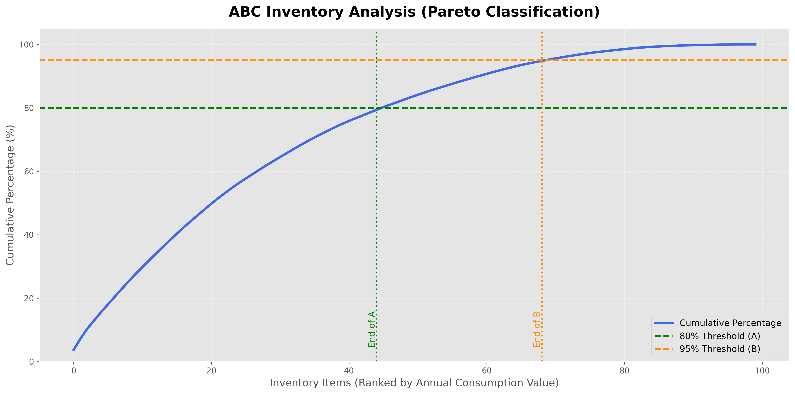
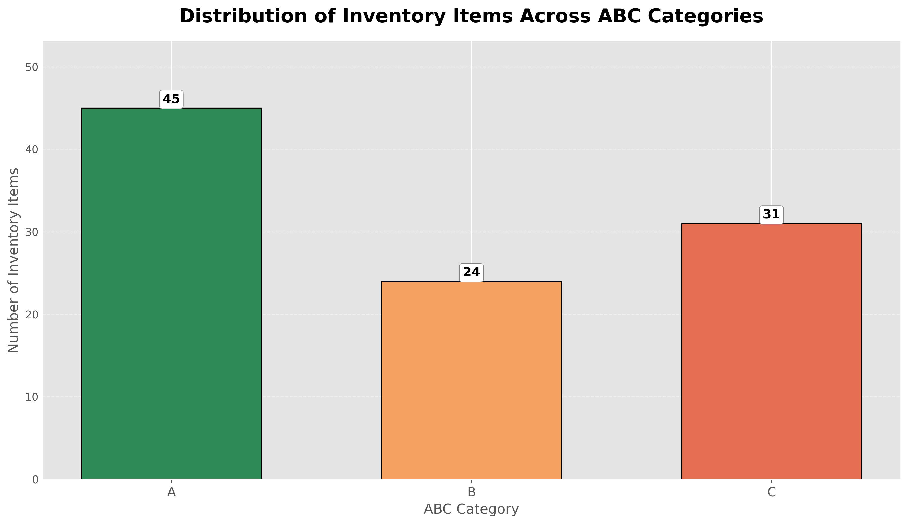

# 📦 ABC-Analysis-with-Python

## 📖 Overview

Not all inventory items deserve the same level of attention.

**ABC Analysis** is one of the most widely used inventory classification techniques in supply chain management. Based on the **Pareto Principle (80/20 Rule)**, it categorizes inventory according to its contribution to the total annual consumption value. This enables organizations to focus their efforts on the relatively small number of items that account for the majority of inventory value.

In this project, an end-to-end ABC Analysis is implemented in **Python** using **Pandas** and **Matplotlib**, from data preparation and classification to visualization and export.

---

## 🎯 Project Objectives

This project demonstrates how to:

- Calculate the **Annual Consumption Value** for each inventory item.
- Rank inventory items in descending order of business value.
- Compute cumulative inventory value and cumulative percentage.
- Classify inventory into the three standard ABC categories:
  - **A Items** – High-value items requiring strict monitoring and tight inventory control.
  - **B Items** – Medium-value items requiring balanced management.
  - **C Items** – Low-value items requiring simpler and less frequent control.
- Visualize the classification using professional charts.
- Export the classified inventory dataset for further reporting and analysis.

---

## 🛠️ Technologies Used

- Python
- Pandas
- NumPy
- Matplotlib

---

## 📊 Loading the Dataset
```python
import pandas as pd
import numpy as np
import matplotlib.pyplot as plt
import seaborn as sns   


df = pd.read_csv("inventory_data.csv")
print(df.head(10))
```

| Item_ID | Annual_Demand | Unit_Cost | Annual_Consumption | Cumulative_Consumption | Cumulative_Percentage | Category |
|---------|--------------:|----------:|-------------------:|-----------------------:|----------------------:|:--------:|
| ITEM_070 | 4,601 | 985.72 | 4,535,297.72 | 4,535,297.72 | 3.73 | A |
| ITEM_098 | 4,648 | 925.07 | 4,299,725.36 | 8,835,023.08 | 7.27 | A |
| ITEM_056 | 3,993 | 962.64 | 3,843,821.52 | 12,678,844.60 | 10.43 | A |
| ITEM_036 | 3,940 | 808.40 | 3,185,096.00 | 15,863,940.60 | 13.05 | A |
| ITEM_077 | 4,937 | 634.14 | 3,130,749.18 | 18,994,689.78 | 15.63 | A |
| ITEM_030 | 4,708 | 635.24 | 2,990,709.92 | 21,985,399.70 | 18.09 | A |
| ITEM_090 | 4,564 | 646.95 | 2,952,679.80 | 24,938,079.50 | 20.52 | A |
| ITEM_094 | 3,149 | 937.05 | 2,950,770.45 | 27,888,849.95 | 22.95 | A |
| ITEM_034 | 3,252 | 893.10 | 2,904,361.20 | 30,793,211.15 | 25.34 | A |
| ITEM_002 | 3,822 | 730.96 | 2,793,729.12 | 33,586,940.27 | 27.64 | A |

## ABC Classification Function

```python
df = df.sort_values(by = "Annual_Consumption", ascending=False).reset_index(drop=True)
# df.head()
df["Cumulative_Consumption"] = (df["Annual_Consumption"].cumsum()).round(2)

total_consumption = df["Annual_Consumption"].sum()
#print(f"Total Annual Consumption: {total_consumption}")
df["Cumulative_Percentage"] = ((df["Cumulative_Consumption"] / total_consumption) * 100).round(2)
#df.tail()  
def abc_classifier(row):
    if row['Cumulative_Percentage'] <= 80:
        return "A"
    elif row['Cumulative_Percentage'] <= 95:
        return "B"
    else:
        return "C"
    
df["Category"] = df.apply(abc_classifier, axis=1)
print(df.head(10))
```
| Item_ID | Annual_Demand | Unit_Cost | Annual_Consumption | Cumulative_Consumption | Cumulative_Percentage (%) | Category |
|:--------|--------------:|----------:|-------------------:|-----------------------:|--------------------------:|:--------:|
| ITEM_070 | 4,601 | 985.72 | 4,535,297.72 | 4,535,297.72 | 3.73 | A |
| ITEM_098 | 4,648 | 925.07 | 4,299,725.36 | 8,835,023.08 | 7.27 | A |
| ITEM_056 | 3,993 | 962.64 | 3,843,821.52 | 12,678,844.60 | 10.43 | A |
| ITEM_036 | 3,940 | 808.40 | 3,185,096.00 | 15,863,940.60 | 13.05 | A |
| ITEM_077 | 4,937 | 634.14 | 3,130,749.18 | 18,994,689.78 | 15.63 | A |
| ITEM_030 | 4,708 | 635.24 | 2,990,709.92 | 21,985,399.70 | 18.09 | A |
| ITEM_090 | 4,564 | 646.95 | 2,952,679.80 | 24,938,079.50 | 20.52 | A |
| ITEM_094 | 3,149 | 937.05 | 2,950,770.45 | 27,888,849.95 | 22.95 | A |
| ITEM_034 | 3,252 | 893.10 | 2,904,361.20 | 30,793,211.15 | 25.34 | A |
| ITEM_002 | 3,822 | 730.96 | 2,793,729.12 | 33,586,940.27 | 27.64 | A |

## 📈 Visualization: ABC Inventory Analysis (Pareto Classification)

```python
a_end = df[df["Category"] == "A"].index.max()
b_end = df[df["Category"] == "B"].index.max()

plt.style.use("ggplot")          # Professional style

fig, ax = plt.subplots(figsize=(14, 7))

ax.plot(
    df.index,
    df["Cumulative_Percentage"],
    color="royalblue",
    linewidth=3,
    label="Cumulative Percentage"
)

ax.axhline(
    80,
    color="green",
    linestyle="--",
    linewidth=2,
    label="80% Threshold (A)"
)

ax.axhline(
    95,
    color="darkorange",
    linestyle="--",
    linewidth=2,
    label="95% Threshold (B)"
)

ax.axvline(
    a_end,
    color="green",
    linestyle=":",
    linewidth=2
)

ax.axvline(
    b_end,
    color="darkorange",
    linestyle=":",
    linewidth=2
)

ax.text(a_end, 5, "End of A",
        rotation=90,
        color="green",
        fontsize=11,
        ha="right")

ax.text(b_end, 5, "End of B",
        rotation=90,
        color="darkorange",
        fontsize=11,
        ha="right")

ax.set_title(
    "ABC Inventory Analysis (Pareto Classification)",
    fontsize=18,
    weight="bold",
    pad=15
)

ax.set_xlabel(
    "Inventory Items (Ranked by Annual Consumption Value)",
    fontsize=13
)

ax.set_ylabel(
    "Cumulative Percentage (%)",
    fontsize=13
)
ax.set_ylim(0, 105)
ax.grid(True, linestyle="--", alpha=0.5)
ax.spines["top"].set_visible(False)
ax.spines["right"].set_visible(False)
ax.legend(frameon=True, fontsize=11)
plt.tight_layout()
plt.savefig(
    "ABC_Analysis.png",
    dpi=300,
    bbox_inches="tight",
    facecolor="white"
)

plt.show()
```


## 📈 Visualization: Distribution of Inventory Items Across ABC Categories
```python
# -------------------------------------
# Count items in each ABC Category
# -------------------------------------
counts = (
    df["Category"]
    .value_counts()
    .reindex(["A", "B", "C"])
)

# -------------------------------------
# Plot Settings
# -------------------------------------
plt.style.use("ggplot")

fig, ax = plt.subplots(figsize=(12, 7))

# Professional colors
colors = ["#2E8B57", "#F4A261", "#E76F51"]

bars = ax.bar(
    counts.index,
    counts.values,
    color=colors,
    width=0.6,
    edgecolor="black",
    linewidth=0.8
)

# -------------------------------------
# Add Value Labels
# -------------------------------------
for bar in bars:
    height = bar.get_height()

    ax.text(
        bar.get_x() + bar.get_width()/2,
        height + 0.3,
        f"{int(height)}",
        ha="center",
        va="bottom",
        fontsize=12,
        fontweight="bold",
        bbox=dict(
            facecolor="white",
            edgecolor="gray",
            boxstyle="round,pad=0.25"
        )
    )

# -------------------------------------
# Labels & Title
# -------------------------------------
ax.set_title(
    "Distribution of Inventory Items Across ABC Categories",
    fontsize=18,
    fontweight="bold",
    pad=18
)

ax.set_xlabel(
    "ABC Category",
    fontsize=13
)

ax.set_ylabel(
    "Number of Inventory Items",
    fontsize=13
)

# -------------------------------------
# Grid
# -------------------------------------
ax.grid(axis="y", linestyle="--", alpha=0.4)
ax.set_axisbelow(True)

# -------------------------------------
# Remove unnecessary spines
# -------------------------------------
ax.spines["top"].set_visible(False)
ax.spines["right"].set_visible(False)

# Remove tick marks but keep labels
ax.tick_params(axis="y", length=0)
ax.tick_params(axis="x", labelsize=12)

# Add some headroom for annotations
ax.set_ylim(0, counts.max() * 1.18)

# -------------------------------------
# Save High Quality Image
# -------------------------------------
plt.tight_layout()

plt.savefig(
    "ABC_Category_Distribution.png",
    dpi=300,
    bbox_inches="tight",
    facecolor="white"
)

plt.show()
```


